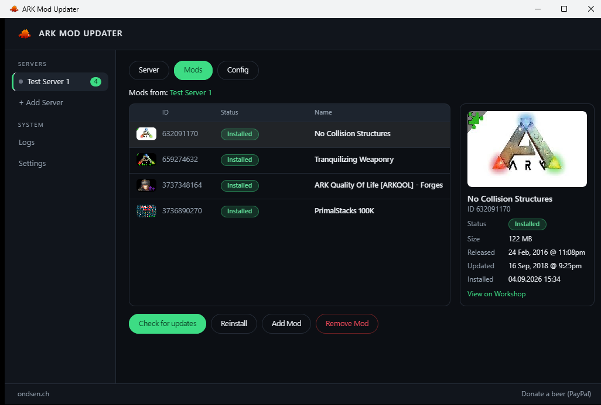
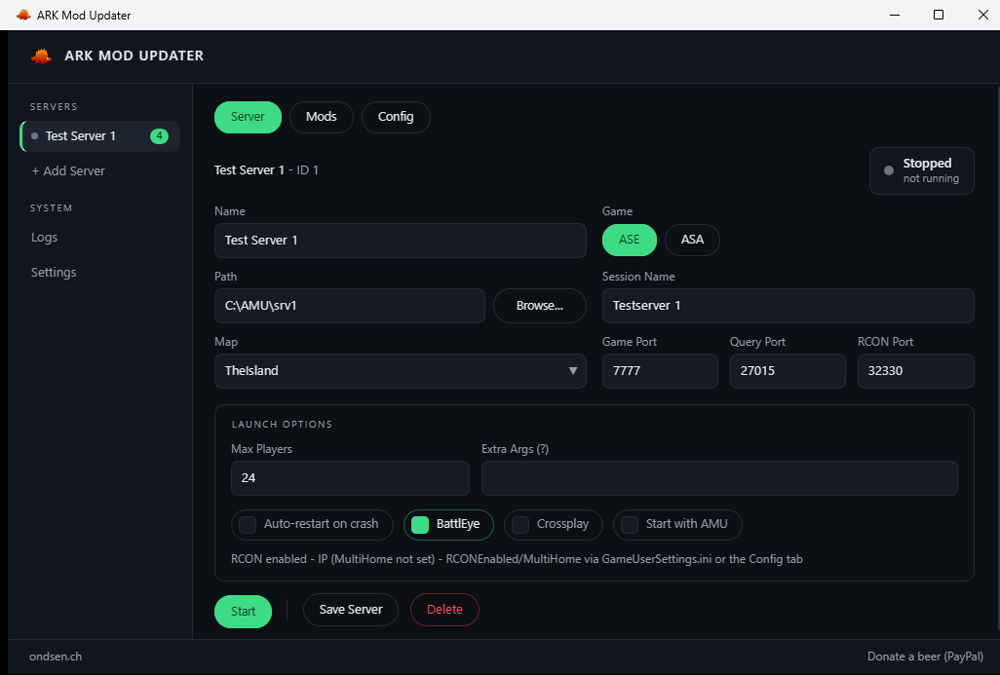
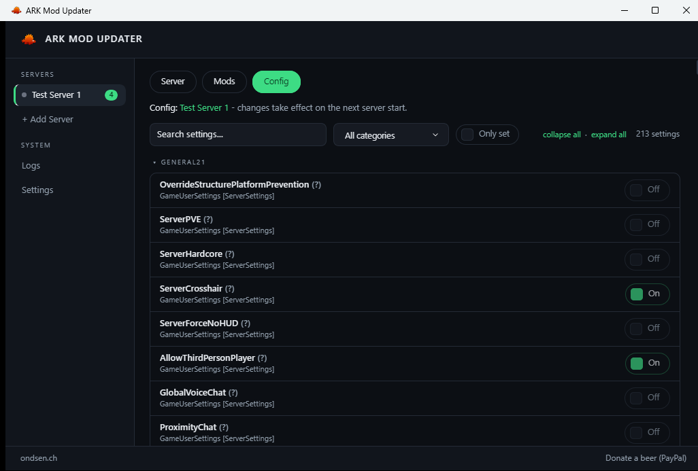
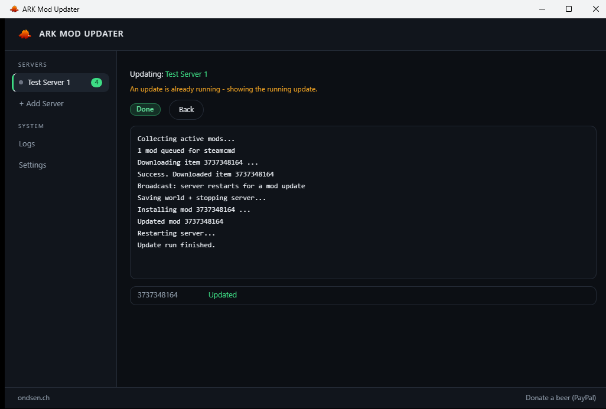

<div align="center">

# 🦖 AMU — ARK Mod Updater

**The all-in-one manager for ARK dedicated servers on Windows** —
install & update Workshop mods, launch & supervise your servers,
and edit every last server setting. One small native app.

[](https://github.com/oNdsen/ark-mod-updater/releases/latest)
[](https://github.com/oNdsen/ark-mod-updater/releases)
[](LICENSE)
[](https://github.com/oNdsen/ark-mod-updater/stargazers)

[](#building)
[](#architecture)
[](https://sciter.com)
[](#tests)
[](https://github.com/oNdsen/ark-mod-updater/issues)

[Download](https://github.com/oNdsen/ark-mod-updater/releases/latest) •
[Features](#-features) •
[Screenshots](#-screenshots) •
[Building](#-building) •
[License](#-license--copyright)

</div>

---

> **v2 is a ground-up C++20 rewrite** of the original AutoIt application
> (2017–2026, now archived at
> [ark-mod-updater-old](https://github.com/oNdsen/ark-mod-updater-old)):
> a tiny native binary, a fully testable core, and a hardened self-updater.

## ✨ Features

- 🧩 **Mod install & update** — drives `steamcmd.exe` with live per-mod
  progress, unpacks ARK's `.z` archives, writes the `.mod` descriptors, and
  keeps `ActiveMods` in `GameUserSettings.ini` in sync. Names, preview images
  and update dates come straight from the Steam Workshop.
- 🚀 **Server launcher & supervisor** — AMU builds the server command line
  itself (no start scripts): start/stop/restart from the UI, graceful RCON
  shutdown (`saveworld` → confirmed fresh save → `DoExit`), crash detection
  with auto-restart & backoff, adoption of already-running servers, live
  status in the sidebar.
- 📡 **Update orchestration** — countdown broadcasts to your players
  (`{minutes}` templating), world-save backup, all-or-nothing mod swap, and
  the server only restarts if it was running before.
- ⚙️ **Full server configurator** — ~370 settings for **ASE and ASA** from
  the community wiki, searchable and categorized, with typed editors,
  tooltips, defaults, and raw editors for the array-style setting families
  (`OverrideNamedEngramEntries`, `PerLevelStatsMultiplier[i]`, …) that
  normal INI tools cannot touch. Unrelated lines, comments and encoding are
  preserved byte-for-byte.
- 🔄 **Hardened self-updater** — updates ship as GitHub Releases with a
  SHA-256 manifest; the standalone `amu_updater.exe` verifies every file
  **before** swapping, with automatic rollback. AMU even bootstraps a
  missing SteamCMD by itself.
- 🔐 **DPAPI credential store** — Steam login data is encrypted per Windows
  user; nothing is ever stored in plain text.
- 🗃️ Servers, mods, settings and logs live in a local SQLite database.

## 📸 Screenshots

<!-- Drop PNGs into docs/screenshots/ and they appear here. -->
| Dashboard & mods | Server & launch options |
| :---: | :---: |
|  |  |
| **Configurator (370 settings)** | **Live update run** |
|  |  |

## 🏗️ Architecture

Two layers, cleanly separated so the entire core is testable without a GUI:

```
┌─────────────────────────────┐
│  amu.exe (Sciter.JS shell)  │  HTML/CSS/JS UI, packed into the exe
├─────────────────────────────┤
│  amucore (static lib, C++20)│  everything below is unit-tested
└─────────────────────────────┘
```

| `amucore` module | Purpose |
| --- | --- |
| `db` | SQLite data layer (prepared statements only) |
| `serverconfig` | `GameUserSettings.ini` / `Game.ini` access incl. the raw rewriter for array-setting families |
| `launchspec` | Pure ASE/ASA command-line builder |
| `supervisor` | Process lifecycle: start, graceful RCON stop, crash auto-restart |
| `orchestrator` | The mod-update pipeline (SteamCMD → unpack → install → restart) |
| `steamcmd_parser` | SteamCMD stdout → typed progress events |
| `zunpack` | ARK/Valve `.z` decompressor |
| `mod_writer` | `.mod` descriptor generator |
| `workshop` | Workshop page scraping (name, preview, last update) |
| `rcon` | Minimal Source-RCON client |
| `credstore` | DPAPI encrypt/decrypt |
| `updatecheck` | Manifest + SHA-256 self-update client |

Plus [`cpp/updater`](cpp/updater) — the standalone `amu_updater.exe` that
applies verified updates while the app is closed.

## 🔨 Building

Requirements: **CMake ≥ 3.21**, **Ninja**, **MSVC** with C++20
(Visual Studio 2022 “Desktop development with C++” workload).
All dependencies are fetched automatically via CMake `FetchContent`
(SQLite, zlib, doctest, Sciter.JS SDK) — no manual setup.

```powershell
cd cpp
cmake --preset default
cmake --build --preset default
```

The binaries land in `cpp/build/` — `amu.exe` runs directly from there
(a loose `ui/` folder next to the exe overrides the packed-in UI for fast
HTML iteration).

### 🧪 Tests

```powershell
ctest --test-dir build --output-on-failure
# or directly: build/tests/amu_tests.exe
```

## 🔄 Updates & releases

Each [GitHub Release](https://github.com/oNdsen/ark-mod-updater/releases)
is the update channel — the app checks
`releases/latest/download/version.txt` and offers one-click updates:

- The install is just **three files**: `amu.exe` (UI packed in),
  `sciter.dll`, `lib/amu_updater.exe`.
- `manifest.txt` lists every file with its **SHA-256** — the updater
  verifies everything *before* touching your install, and rolls back on any
  failure.
- `steamcmd.exe` ships as an extra asset; AMU downloads it automatically
  when missing.
- `amu-cpp-<version>.zip` is attached for manual installs.

Maintainers: `publish.ps1` builds the whole asset set and prints the
matching `gh release create` command.

## 🙏 Credits

- [Sciter.JS](https://sciter.com) — the embedded HTML/CSS/JS UI engine (free tier)
- [Valve SteamCMD](https://developer.valvesoftware.com/wiki/SteamCMD) — Workshop downloads (Valve's software, not part of this project)
- [SQLite](https://sqlite.org) (public domain) • [zlib](https://zlib.net) (zlib license) • [doctest](https://github.com/doctest/doctest) (MIT)
- ARK server setting documentation based on the
  [ARK Community Wiki](https://ark.wiki.gg/wiki/Server_configuration)

## 📜 License & copyright

Licensed under the **[MIT License](LICENSE)** — free to use, modify and
redistribute, commercially or not. **One condition is not optional:** the
copyright notice

```
Copyright (c) 2026 oNdsen
```

**must remain** in all copies and substantial portions of the software,
including forks and derived projects (that is the retention clause of the
MIT license itself). Removing the notice is a license violation.

<div align="center">

---

**© 2026 [oNdsen](https://ondsen.ch)** — made with 🦖 for the ARK community

⭐ *If AMU saves you time, a star keeps the dinos fed.*

</div>
